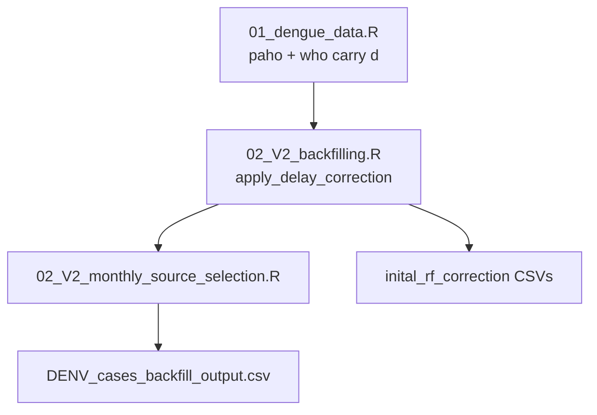

# Lab notebook: V2 PAHO + WHO delay correction

**Date:** 2026-06-11  
**Project:** Global Dengue Observatory (`DENV_global_observatory`)  
**Author:** K M Susong (with AI-assisted implementation)  
**Status:** Integrated into production pipeline (`V1_Pipeline.R` Step 4)

---

## Objective

Replace the PAHO-only reporting-delay correction (`apply_reporting_correction()` + `emp_est_PAHO_report_factor.csv`) with a source-aware V2 method that:

1. Corrects **both PAHO and WHO Global** data using stable empirical RF lookups.
2. Never drops country-months for lack of a reporting factor (raw fallback via an **applied** case column).
3. Preserves audit metadata through source selection for methods reporting and paper statistics.
4. Remains backward-compatible with the existing V1 PAHO monthly aggregation functions (guarded additive edits only).

---

## Background

Reporting-delay correction (backfilling) adjusts observed case counts using empirically estimated **reporting factors (RFs)**. Early GDO versions applied this only to PAHO weekly data via a legacy lookup and a `1.000001` sentinel when no factor was available.

V2 extends correction to WHO monthly data, uses refreshed crawler-based RF tables (`paho_rf_lookup.csv`, `who_rf_lookup.csv`), and applies explicit exclusion rules (Belize, minimum sample sizes, RF caps). Reporting delay `d` is computed at **data load** in `01_dengue_data.R` for both sources, so the correction function only joins lookups and applies rules.

---

## Implementation log

### Phase 0 — Reporting delay at load

| Item | File | Notes |
|------|------|-------|
| PAHO weekly `d` | `Scripts/data_sourcing/01_dengue_data.R` | Weeks between download epiweek and onset epiweek |
| PAHO `d_unit` | same | `"week"` added for parity with WHO/SEARO |
| WHO monthly `d` | same | Months between download month and observation month |

### Phase 1 — New correction function

**File:** `Scripts/backfilling/FUNCTIONS/00_FUN_apply_delay_correction.R`

| Function | Role |
|----------|------|
| `load_rf_lookup()` | Read and validate `paho_rf_lookup.csv` or `who_rf_lookup.csv` |
| `select_rf_from_lookup()` | RF selection + exclusion reasons (ordered rules) |
| `apply_delay_correction()` | Join lookup on `(iso3, d)`, multiply cases, emit audit columns |

**Exclusion / selection rules**

| Rule | PAHO | WHO |
|------|------|-----|
| Min paired observations (`n_rf`) | 20 | 3 |
| Max RF | 5 | 5 |
| High spread → use median | `sd_rf > 1.5` | `sd_rf > 1.5` |
| Country exclusion | Belize (`BLZ`) | none |

### Phase 1b — Three-column case design + PAHO process guards

**Design decision:** emit `raw`, `corrected` (NA-able), and `applied` (`coalesce(corrected, raw)`) so downstream steps never lose a value when correction is excluded.

**File:** `Scripts/backfilling/FUNCTIONS/00_FUN_paho_data_process.R`

- Additive guarded blocks for `total_applied_cases` in `compute_monthcumm_cases()` and `PAHO_incid_monthly()`.
- V1 path unchanged: legacy correction never produces `total_applied_cases`, so guards are skipped.

### Phase 2 — Backfilling script

**File:** `Scripts/backfilling/02_V2_backfilling.R`

- Sources `apply_delay_correction()` for PAHO and WHO.
- Writes audit CSVs to `Output/YYYY_MM_DD/inital_rf_correction/`:
  - `correction_paho_weekly.csv`
  - `correction_who_monthly.csv`
- Country tracking at `Step_4a_PAHO_After_Correction` and `Step_4b_WHO_After_Correction`.

### Phase 3 — Monthly source selection

**File:** `Scripts/backfilling/02_V2_monthly_source_selection.R`

- PAHO: `computed_monthly_cases_applied` → `cases` in `paho_add`.
- WHO: `cases_applied` from `who_correction` → `cases` in `who_add`.
- SEARO: uncorrected; placeholder audit columns (`correction_applied = FALSE`).
- `current_data` / `DENV_cases_backfill_output.csv` retains: `raw_cases`, `corrected_cases`, `d`, `rf`, `correction_applied`, `correction_reason`, `missing_reason`.
- Source priority unchanged: PAHO/SEARO over WHO; Indonesia prefers WHO from June 2025.

### Pipeline integration

**File:** `Scripts/V1_Pipeline.R` (2026-06-08)

```r
source("Scripts/backfilling/02_V2_monthly_source_selection.R")
```

Legacy script `02_PAHO_monthly_cases_and_source_selection.R` retained but no longer sourced.

### Supporting updates

| File | Change |
|------|--------|
| `Scripts/utils/country_tracking.R` | Step 4 sub-steps: 4a PAHO correction, 4b WHO correction, 4b PAHO negative handling |
| `pages/methods.qmd` | Public methods text simplified for general audience |
| `observatory_methods_report.md` | Internal technical documentation (Section 6 rewrite) |

---

## Pipeline flow (V2 Step 4)



---

## Validation (2026-06-11)

**Reference runs**

| Run | Directory | Step 4 script |
|-----|-----------|---------------|
| V1 baseline | `Output/2026_06_11_V1` | `02_PAHO_monthly_cases_and_source_selection.R` |
| V2 | `Output/2026_06_11_V2` | `02_V2_monthly_source_selection.R` |
| Production | `Output/2026_06_11` | V2 (full pipeline) |

**Artifacts:** `Output/validation/V2_correction/` (comparison CSVs + `02_V2_correction_validation.html`)

### Production pipeline log (`pipeline_log_20260611_151427.txt`)

- Completed without fatal errors.
- PAHO correction: 2,650 / 7,326 rows corrected; 4,676 excluded (mostly `no_lookup_match`).
- WHO correction: 905 / 11,492 rows corrected; 10,531 excluded (mostly `no_lookup_match`).
- `bind_rows` succeeded (13,707 combined source rows).
- `current_data`: 4,704 country-months, 196 countries.
- Final dashboard countries: 85 (was 83 on 2026-06-02 V1 run).

### Backfill comparison (V1 vs V2)

| Metric | Value |
|--------|-------|
| Rows (both) | 4,704 |
| Identical case counts | 2,520 (54%) |
| Rows with case differences | 207 |
| Source switches | 2 (ATG, ARG in validation snapshot) |
| Median absolute delta | 25 |
| Max absolute delta | 42,409 (BRA, 2026-05, PAHO) |

**Largest impacts by country (backfill):** BRA, GTM, BOL, SDN, PAK, ARG, PER, GUY.

### Belize check

All BLZ rows: `correction_applied = FALSE`, `correction_reason = country_excluded`, `cases = raw_cases`. Matches design.

### Correction in GDO output (`Output/2026_06_11/DENV_cases_backfill_output.csv`)

| Metric | Value |
|--------|-------|
| Country-months with `correction_applied == TRUE` | 811 |
| Jan–May 2026 global applied sum | 1,416,174 |
| Jan–May 2026 global raw sum | 1,330,062 |
| Jan–May 2026 correction impact | +86,112 (+6.5%) |

### Country tracking (production run)

| Step | Countries |
|------|-----------|
| Step_4a_PAHO_After_Correction | 49 |
| Step_4b_WHO_After_Correction | 196 |
| Step_4b_PAHO_After_Negative_Handling | 49 |
| Step_4_Current_Data | 196 |
| Step_6_Final | 85 |

---

## Issues encountered and resolutions

| Issue | Resolution |
|-------|------------|
| `bind_rows` type error on `corrected_cases` (SEARO used character `"NA"`) | Changed to `NA_real_`; fixed SEARO `rf` / `correction_applied` types |
| `names(df)` typo in SEARO RF setup | Fixed to `names(searo)` |
| WHO `raw_cases` assigned after `cases = cases_applied` in `mutate()` | Fixed: `raw_cases = cases` before `cases = cases_applied` |
| `missing value where TRUE/FALSE needed` warnings in Step 4 | Non-fatal; likely `ifelse`/`countrycode` NA paths in tracking — low priority cleanup |
| PAHO `d` duplicated in `compute_monthcumm_cases()` | Legacy duplication retained; Step 2 `d` used by correction; monthly step recomputes for aggregation |

---

## Key design decisions (for review)

1. **Applied column over sentinel RF** — avoids dropping months and simplifies downstream logic vs `1.000001`.
2. **Correction before source selection** — WHO and PAHO corrected independently; winning source carries its audit metadata into `current_data`.
3. **In-place PAHO function extension** — guarded `if ("total_applied_cases" %in% names(...))` blocks rather than forking `00_FUN_paho_data_process.R`.
4. **Belize PAHO-only exclusion** — replaced V1 list of four countries; only BLZ excluded in V2 rules.
5. **SEARO uncorrected** — no production lookup yet; included with raw counts only.

---

## Deliverables

| Deliverable | Location |
|-------------|----------|
| Correction function | `Scripts/backfilling/FUNCTIONS/00_FUN_apply_delay_correction.R` |
| V2 backfill + selection | `Scripts/backfilling/02_V2_backfilling.R`, `02_V2_monthly_source_selection.R` |
| Stable RF lookups | `Assets/Stable/paho_rf_lookup.csv`, `who_rf_lookup.csv` |
| Per-run audit | `Output/YYYY_MM_DD/inital_rf_correction/` |
| GDO backfill with audit cols | `Output/YYYY_MM_DD/DENV_cases_backfill_output.csv` |
| V1 vs V2 validation | `Output/validation/V2_correction/` |
| Public methods | `pages/methods.qmd` |
| Internal methods | `observatory_methods_report.md` |

---

## Open items

| Item | Priority | Notes |
|------|----------|-------|
| `04_correction_impact_summary.R` | Medium | Automated paper-ready summary from `current_data` + audit CSVs |
| Spot-check BRA, GTM, ARG, BHS, VEN | High | Largest V1→V2 deltas; confirm RF behaviour is intended |
| SEARO RF lookup + correction | Future | Pipeline stub exists; no production lookup yet |
| Clean up Step 4 `ifelse` NA warnings | Low | Cosmetic log noise |
| Commit RF lookup CSVs if not on remote | High | Required for CI daily pipeline |
| Re-render Quarto site | Low | Publish updated `pages/methods.html` |

---

## How to reproduce

```bash
# Full production pipeline (V2 Step 4)
Rscript Scripts/V1_Pipeline.R

# Standalone Step 4 (after data load)
Rscript -e 'source("Scripts/data_sourcing/01_dengue_data.R"); source("Scripts/backfilling/02_V2_monthly_source_selection.R")'

# Refresh RF lookups from crawlers (offline maintenance)
Rscript Scripts/backfilling/00_RF_calculate.R
```

---

## References

- Implementation plan: `.cursor/plans/v2_delay_correction_9cadba62.plan.md`
- Legacy V1 backfill: `Scripts/backfilling/02_PAHO_monthly_cases_and_source_selection.R`
- RF estimation pipeline: `Scripts/backfilling/FUNCTIONS/00_FUN_dengue_rf_pipeline.R`
