# DENV Global Observatory: Pipeline and Dashboard Methods Report

This report documents the full data pipeline, dashboard rendering methods, map generation, validation framework, national page architecture, and all auto-generated text logic for the DENV (Dengue) Global Observatory. It includes detailed flowcharts for every major data decision and text generation pathway.

------------------------------------------------------------------------

## 1. Executive Overview

The **DENV Global Observatory** is a Quarto-based web dashboard that provides near-real-time surveillance of dengue cases at country, regional, and global levels. It combines data from four external sources (PAHO, WHO, SEARO, OpenDengue), applies backfilling and seasonal baseline methods, performs proportion-based nowcasting for missing recent months, and classifies severity using a negative binomial distribution. The dashboard renders radial "clockface" plots, choropleth ratio maps, auto-generated narrative text, interactive national summary pages, and downloadable data for exploration. A separate validation framework evaluates nowcast accuracy via leave-one-season-out cross-validation and produces calibrated prediction intervals.

**End-to-end flow:**

1. **Pipeline:** External data sources → Data sourcing & ingestion → Historic data selection (OD + WHO) → Seasonal baseline identification → Backfilling & source selection → Proportion nowcasting → Region assignment → Severity classification → Output CSVs.
2. **Maps:** Latest nowcast CSV → Cumulative ratio calculation → Global and regional choropleth maps → `Assets/Dynamic/`.
3. **Validation:** Pipeline writes `full_data_season_monthly_proportions.csv` → [`Scripts/validation/ORC_nowcast_validation.R`](Scripts/validation/ORC_nowcast_validation.R) runs LOSO detail, summaries/quantiles/coverage, snapshot convergence, and figures → `Output/validation/` and `Assets/Stable/calibrated_prediction_intervals.csv`.
4. **Dashboard:** Load latest CSV → Aggregate by country/region/world → Generate plots, text, and tables → Quarto render → Static site in `docs/`.
5. **National pages:** Country-level data + radial plot + Chart.js interactive time series + calibrated prediction intervals → template-driven pages for ~81 countries (`pages/country/`, generated from `country-config.csv`).

------------------------------------------------------------------------

## 2. Data Pipeline (V1_Pipeline.R)

The main pipeline is orchestrated by [`Scripts/V1_Pipeline.R`](Scripts/V1_Pipeline.R). It runs in sequence: logging setup, data sourcing, historic selection, seasonal baseline, backfilling, nowcasting, region assignment, severity classification, and output writing.

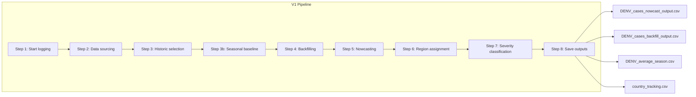
``` mermaid
flowchart LR
  subgraph pipeline [V1 Pipeline]
    S1[Step 1: Start logging]
    S2[Step 2: Data sourcing]
    S3[Step 3: Historic selection]
    S3b[Step 3b: Seasonal baseline]
    S4[Step 4: Backfilling]
    S5[Step 5: Nowcasting]
    S6[Step 6: Region assignment]
    S7[Step 7: Severity classification]
    S8[Step 8: Save outputs]
  end
  S1 --> S2 --> S3 --> S3b --> S4 --> S5 --> S6 --> S7 --> S8
  S8 --> Out1[DENV_cases_nowcast_output.csv]
  S8 --> Out2[DENV_cases_backfill_output.csv]
  S8 --> Out3[DENV_average_season.csv]
  S8 --> Out4[country_tracking.csv]
```

------------------------------------------------------------------------

## 3. Data Sourcing (Step 2)

Step 2 is implemented in [`Scripts/data_sourcing/01_dengue_data.R`](Scripts/data_sourcing/01_dengue_data.R). Four sources are loaded:

| Source         | Type              | Access                                                           | Format        |
|----------------|-------------------|------------------------------------------------------------------|---------------|
| **PAHO**       | Real-time weekly  | GitHub API → `DengueGlobalObservatory/PAHO-crawler`              | UTF-16LE TSV  |
| **WHO**        | Real-time monthly | GitHub API → `DengueGlobalObservatory/WHOGlobal-crawler`         | Excel (.xlsx) |
| **SEARO**      | Real-time monthly | GitHub API → `DengueGlobalObservatory/SEARO-crawler`             | CSV           |
| **OpenDengue** | Historic national | Local file `Assets/Stable/OD_maps/pred_downscale_with_ci_V3.csv` | CSV           |

PAHO uses a 51-entry country name mapping (Spanish → English, in `normalize_country()`, `Scripts/data_sourcing/FUNCTIONS/00_FUN_realtime_data_download.R`) and column normalization for Spanish/English column names. Authentication uses the `GITHUB_TOKEN` environment variable when available.

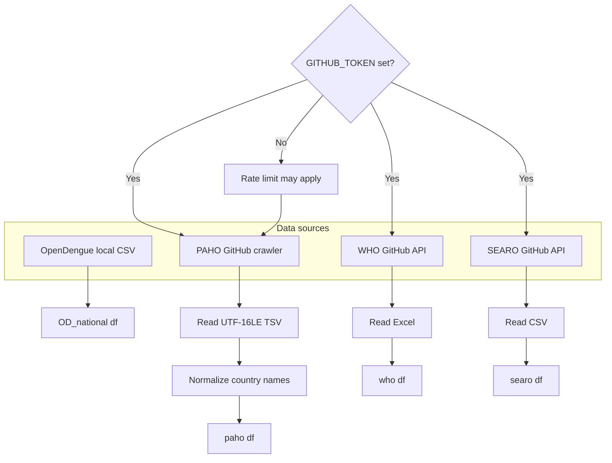
``` mermaid
flowchart TB
  subgraph sources [Data sources]
    PAHO[PAHO GitHub crawler]
    WHO[WHO GitHub API]
    SEARO[SEARO GitHub API]
    OD[OpenDengue local CSV]
  end
  Auth{GITHUB_TOKEN set?}
  Auth -->|Yes| PAHO
  Auth -->|Yes| WHO
  Auth -->|Yes| SEARO
  Auth -->|No| RateLimit[Rate limit may apply]
  RateLimit --> PAHO
  OD --> OD_national[OD_national df]
  PAHO --> ReadPAHO[Read UTF-16LE TSV]
  ReadPAHO --> NormPAHO[Normalize country names]
  NormPAHO --> paho[paho df]
  WHO --> ReadWHO[Read Excel]
  ReadWHO --> who[who df]
  SEARO --> ReadSEARO[Read CSV]
  ReadSEARO --> searo[searo df]
```

Reporting delay (`d`) is computed at load for PAHO (weeks between download epiweek and onset epiweek) and WHO/SEARO (months between download month and observation month). PAHO also carries `d_unit = "week"`; WHO and SEARO use `d_unit = "month"`.

------------------------------------------------------------------------

## 4. Historic Data Selection (Step 3)

Historic data is prepared in [`Scripts/data_sourcing/01_select_historic_data.R`](Scripts/data_sourcing/01_select_historic_data.R). OpenDengue and WHO data are combined with source preference: for each country-month, OpenDengue is preferred over WHO when both exist. Filters: `Year > 2009`, remove all-zero years. WHO missing values are interpolated (linear, maxgap=1 for monthly). **OD preparation in the current pipeline is limited to filtering and `distinct()` deduplication — no continuity-based dedup and no OD interpolation are applied.** (A more elaborate OD dedup/interpolation implementation — continuity-based source selection per country-year, plus interpolation at maxgap=1 monthly / maxgap=4 weekly — exists in [`Scripts/data_sourcing/FUNCTIONS/00_OpenDengue_national_data_processing_functions.R`](Scripts/data_sourcing/FUNCTIONS/00_OpenDengue_national_data_processing_functions.R), but this file is not sourced anywhere in the current pipeline; treat it as orphaned/legacy until reintegrated.)

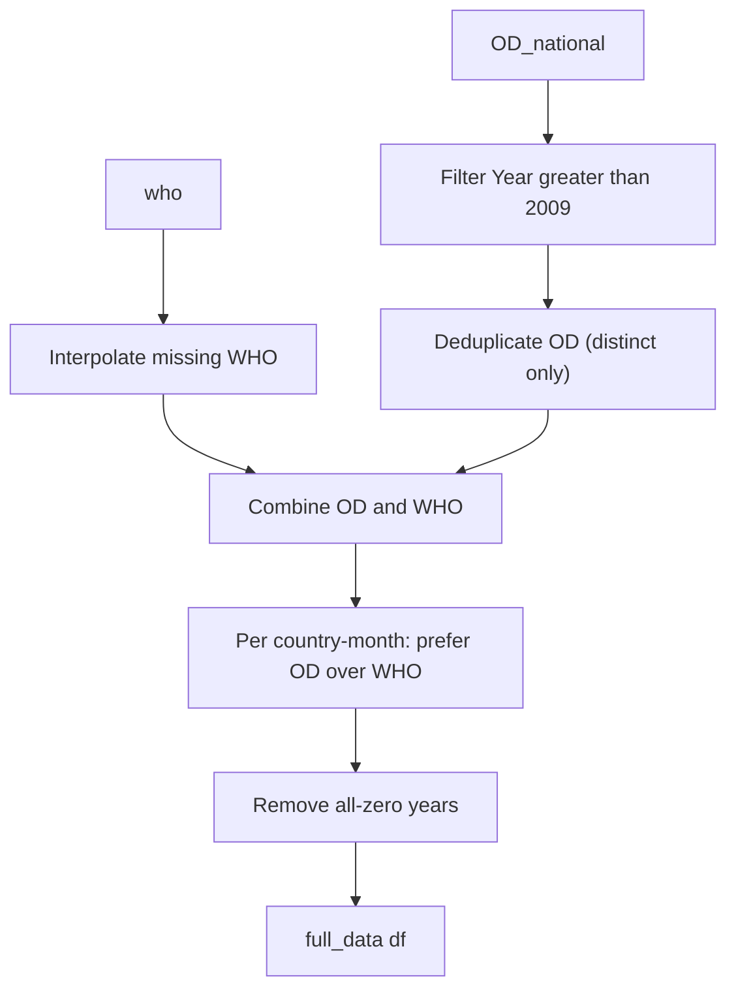
``` mermaid
flowchart TB
  OD[OD_national] --> FilterOD[Filter Year greater than 2009]
  WHO[who] --> InterpWHO[Interpolate missing WHO]
  FilterOD --> Dedup["Deduplicate OD (distinct only)"]
  InterpWHO --> Combine[Combine OD and WHO]
  Dedup --> Combine
  Combine --> Prefer[Per country-month: prefer OD over WHO]
  Prefer --> RemoveZero[Remove all-zero years]
  RemoveZero --> full_data[full_data df]
```

------------------------------------------------------------------------

## 5. Seasonal Baseline Identification (Step 3b)

The seasonal baseline is computed in [`Scripts/seasonal_baseline/02_identify_seasonal_baseline.R`](Scripts/seasonal_baseline/02_identify_seasonal_baseline.R). For each country, the low-transmission month is found (circular mean), calendar months are aligned to season months (`season_nMonth`), and a filtering cascade is applied before computing average monthly cases, proportions, and negative binomial parameters.

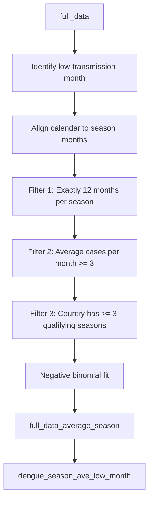
``` mermaid
flowchart TB
  full_data[full_data] --> LowMonth[Identify low-transmission month]
  LowMonth --> Align[Align calendar to season months]
  Align --> F1[Filter 1: Exactly 12 months per season]
  F1 --> F2[Filter 2: Average cases per month >= 3]
  F2 --> F3[Filter 3: Country has >= 3 qualifying seasons]
  F3 --> NB[Negative binomial fit]
  NB --> Output[full_data_average_season]
  Output --> dengue_season_ave_low_month[dengue_season_ave_low_month]
```

Outputs include `Ave_season_monthly_cases`, `Ave_monthly_proportion`, `Ave_cum_monthly_proportion`, `nb_size`, `nb_mean`, and cumulative NB parameters (`nb_size_cum`, `nb_mean_cum`) for later severity classification.

------------------------------------------------------------------------

## 6. Backfilling and Source Selection (Step 4)

Step 4 is implemented in [`Scripts/backfilling/02_V2_monthly_source_selection.R`](Scripts/backfilling/02_V2_monthly_source_selection.R), which sources [`Scripts/backfilling/02_V2_backfilling.R`](Scripts/backfilling/02_V2_backfilling.R) for delay correction and [`Scripts/backfilling/FUNCTIONS/00_FUN_apply_delay_correction.R`](Scripts/backfilling/FUNCTIONS/00_FUN_apply_delay_correction.R) for the shared PAHO/WHO correction logic. PAHO monthly aggregation remains in [`Scripts/backfilling/FUNCTIONS/00_FUN_paho_data_process.R`](Scripts/backfilling/FUNCTIONS/00_FUN_paho_data_process.R).

**Reporting-factor lookups:** stable tables `Assets/Stable/paho_rf_lookup.csv` and `Assets/Stable/who_rf_lookup.csv` (refreshed from crawler snapshots via [`Scripts/backfilling/00_RF_calculate.R`](Scripts/backfilling/00_RF_calculate.R)). SEARO is not corrected in production (no lookup applied).

**Correction rules (per row, joined on `iso3` + `d`):**

| Rule | PAHO | WHO Global |
|------|------|------------|
| Minimum paired observations (`n_rf`) | 20 | 3 |
| Maximum factor | 5 | 5 |
| Use median when `sd_rf` > 1.5, else mean | Yes | Yes |
| Country exclusions | Belize (`BLZ`) | None |
| Rows excluded / no match | Keep raw via applied column | Keep raw via applied column |

**Three-column case design:** each corrected row carries raw cases, corrected cases (NA when excluded), and **applied** cases (`coalesce(corrected, raw)`). Downstream steps and published totals use applied cases only, so missing or excluded factors never drop a country-month.

**PAHO path:** weekly cumulative `total_den` → weekly correction → monthly cumulative applied counts → monthly incident cases (`computed_monthly_cases_applied`). Negative monthly differences fall back to uncorrected monthly values; values &lt; 1 set to NA.

**WHO path:** monthly `cases` corrected in place; `cases_applied` passed to source selection.

**Audit outputs:** weekly PAHO and monthly WHO correction tables written to `Output/YYYY_MM_DD/inital_rf_correction/`. `DENV_cases_backfill_output.csv` retains `raw_cases`, `corrected_cases`, `rf`, `correction_applied`, and `correction_reason` for the winning source per country-month.

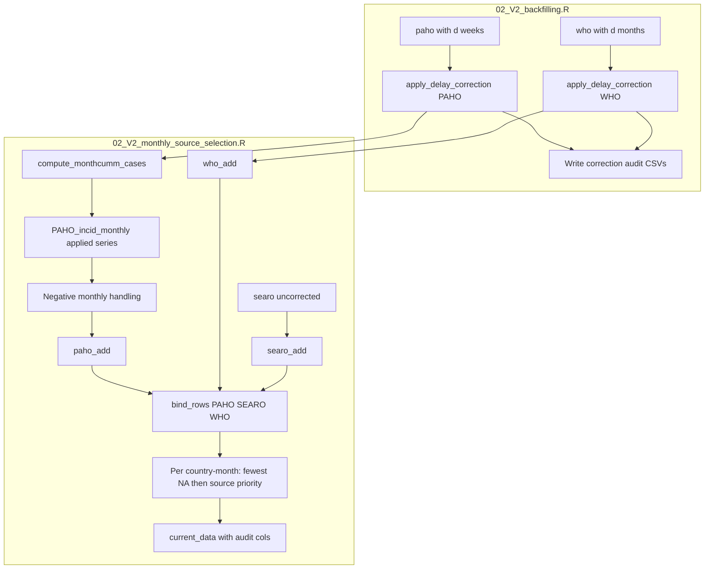
``` mermaid
flowchart TB
  subgraph backfill [02_V2_backfilling.R]
    PAHOin[paho with d weeks] --> PAHOcorr[apply_delay_correction PAHO]
    WHOin[who with d months] --> WHOcorr[apply_delay_correction WHO]
    PAHOcorr --> Audit[Write correction audit CSVs]
    WHOcorr --> Audit
  end
  subgraph monthly [02_V2_monthly_source_selection.R]
    PAHOcorr --> MonthCumm[compute_monthcumm_cases]
    MonthCumm --> MonthIncid[PAHO_incid_monthly applied series]
    MonthIncid --> NegHandle[Negative monthly handling]
    NegHandle --> paho_add[paho_add]
    WHOcorr --> who_add[who_add]
    searo[searo uncorrected] --> searo_add[searo_add]
    paho_add --> Merge[bind_rows PAHO SEARO WHO]
    who_add --> Merge
    searo_add --> Merge
    Merge --> Priority[Per country-month: fewest NA then source priority]
    Priority --> current_data[current_data with audit cols]
  end
```

**Multi-source merge priority:** for each country-month, prefer the row with the fewest missing applied cases; ties broken by source priority — PAHO/SEARO over WHO for most countries; **Indonesia (`IDN`) prefers WHO** from June 2025 onward. SEARO zeros are treated as NA; SEARO rows for Indonesia from June 2025 onward are dropped.

**Country tracking sub-steps:** `Step_4a_PAHO_After_Correction`, `Step_4b_WHO_After_Correction`, `Step_4b_PAHO_After_Negative_Handling`, then `Step_4_Current_Data`.

Legacy V1 backfill ([`02_PAHO_monthly_cases_and_source_selection.R`](Scripts/backfilling/02_PAHO_monthly_cases_and_source_selection.R) + `emp_est_PAHO_report_factor.csv`) remains in the repository but is no longer sourced by the pipeline.

**Note:** [`Scripts/backfilling/03_whosearo_backfill.R`](Scripts/backfilling/03_whosearo_backfill.R) also exists in the repository and is not sourced by `V1_Pipeline.R` or `02_V2_monthly_source_selection.R`. It appears to be experimental/in-progress work on WHO/SEARO backfilling and is not part of the production pipeline described above.

------------------------------------------------------------------------

## 7. Proportion Nowcasting (Step 5)

Nowcasting is implemented in [`Scripts/nowcasting/03_proportion_nowcast.R`](Scripts/nowcasting/03_proportion_nowcast.R). Seasonal baseline and current data are merged (outer join on `iso3`, `season_nMonth`, `Month`). Predicted total seasonal cases = cumulative cases to date / average cumulative proportion to that month. Missing recent months are filled with predicted total × average monthly proportion; filled rows are marked `source = "Estimates"`. A two-pass approach recalculates cumulatives after the first estimation pass.

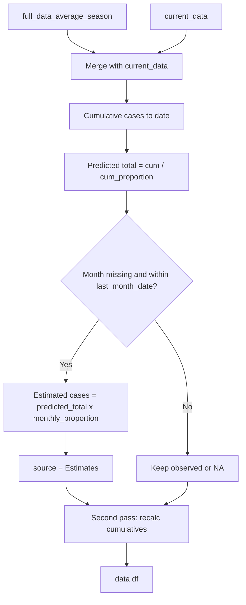
``` mermaid
flowchart TB
  full_data_average_season[full_data_average_season] --> Merge[Merge with current_data]
  current_data[current_data] --> Merge
  Merge --> Cum[Cumulative cases to date]
  Cum --> PredTot[Predicted total = cum / cum_proportion]
  PredTot --> Fill{Month missing and within last_month_date?}
  Fill -->|Yes| Est[Estimated cases = predicted_total x monthly_proportion]
  Fill -->|No| Keep[Keep observed or NA]
  Est --> Mark[source = Estimates]
  Mark --> Pass2[Second pass: recalc cumulatives]
  Keep --> Pass2
  Pass2 --> data[data df]
```

------------------------------------------------------------------------

## 8. Severity Classification (Step 7)

Severity is computed in [`Scripts/V1_Pipeline.R`](Scripts/V1_Pipeline.R) (Step 7). For each country and season month, the cumulative cases to date are compared to the negative binomial cumulative distribution (`pnbinom`) parameterized by `nb_size_cum` and `nb_mean_cum`. The percentile determines the severity label. Z-scores use the approximation `(observed - mean) / sqrt(mean + mean^2/size)`.

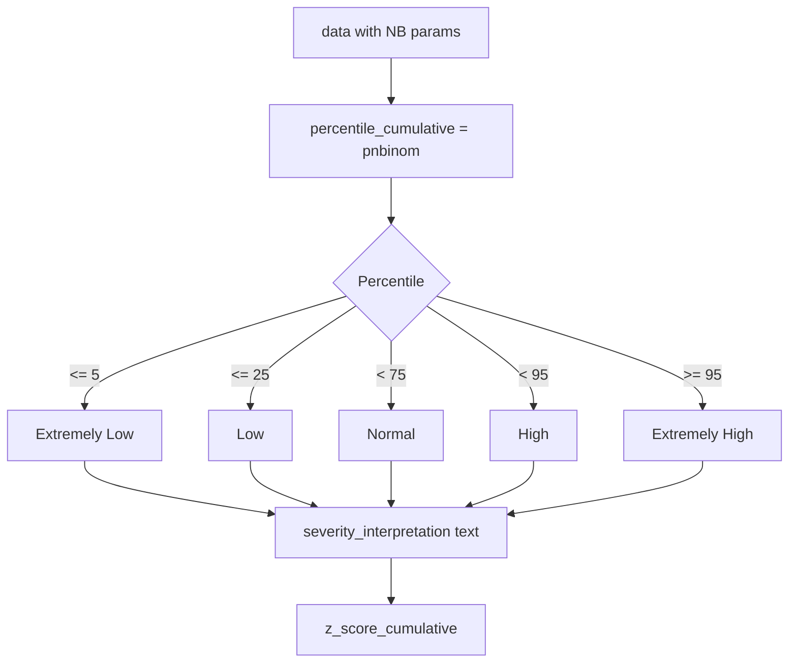
``` mermaid
flowchart TB
  data_sev[data with NB params] --> Pct[percentile_cumulative = pnbinom]
  Pct --> Class{Percentile}
  Class -->|<= 5| EL[Extremely Low]
  Class -->|<= 25| L[Low]
  Class -->|< 75| N[Normal]
  Class -->|< 95| H[High]
  Class -->|>= 95| EH[Extremely High]
  EL --> Interp[severity_interpretation text]
  L --> Interp
  N --> Interp
  H --> Interp
  EH --> Interp
  Interp --> Z[z_score_cumulative]
```

Interpretation text: "Rare good event - unusually low cases to date" (Extremely Low), "Below average - fewer cases than typical at this point" (Low), "Average - typical case load at this point" (Normal), "Above average - more cases than typical at this point" (High), "Rare bad event - unusually high cases to date" (Extremely High).

------------------------------------------------------------------------

## 9. Dashboard Rendering Pipeline

The dashboard is prepared by [`Scripts/V1_Dashboard_setup.R`](Scripts/V1_Dashboard_setup.R), which is sourced by each Quarto page. It loads the latest `DENV_cases_nowcast_output.csv` from the most recent date-stamped folder under `Output/`, cleans the data (drops unnamed first column, sets future months to NA), aggregates by country/region/world, generates radial plots, builds all auto-text, and exposes objects to Quarto.

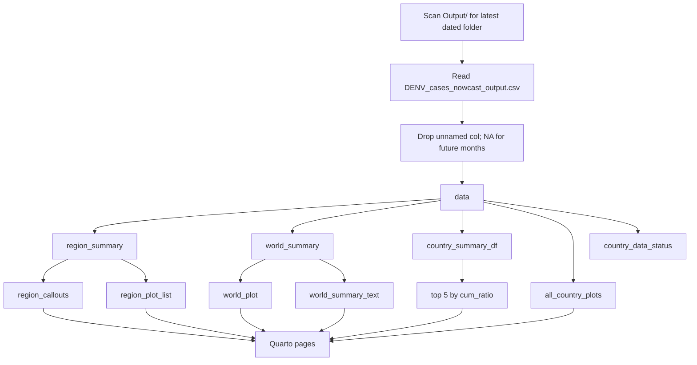
``` mermaid
flowchart TB
  OutputDir[Scan Output/ for latest dated folder]
  OutputDir --> CSV[Read DENV_cases_nowcast_output.csv]
  CSV --> Clean[Drop unnamed col; NA for future months]
  Clean --> data[data]
  data --> RegionAgg[region_summary]
  data --> WorldAgg[world_summary]
  data --> CountrySum[country_summary_df]
  RegionAgg --> region_callouts[region_callouts]
  RegionAgg --> region_plot_list[region_plot_list]
  data --> all_country_plots[all_country_plots]
  WorldAgg --> world_plot[world_plot]
  WorldAgg --> world_summary_text[world_summary_text]
  CountrySum --> top_severity_countries[top 5 by cum_ratio]
  data --> country_data_status[country_data_status]
  region_plot_list --> Quarto[Quarto pages]
  world_plot --> Quarto
  all_country_plots --> Quarto
  region_callouts --> Quarto
  world_summary_text --> Quarto
  top_severity_countries --> Quarto
```

**Future data masking:** Rows with `Year > current_year` or `(Year == current_year & Month > recent_month)` have `cases`, `cum_todate_cases_year`, and `cum_todate_cases_season` set to NA.

**Radial plot time window** (in [`Scripts/figures/Radial.R`](Scripts/figures/Radial.R)): if `month > 6` show current year only; if `month == 1` show prior year; if `month` in 2–6 show rolling 6 months spanning two years.

------------------------------------------------------------------------

## 10. Auto-Text Generation — ratio_phrase()

`ratio_phrase()` is defined in [`Scripts/V1_Dashboard_setup.R`](Scripts/V1_Dashboard_setup.R). It returns a short phrase describing how the current ratio compares to the seasonal baseline (e.g. "running well above the seasonal baseline").

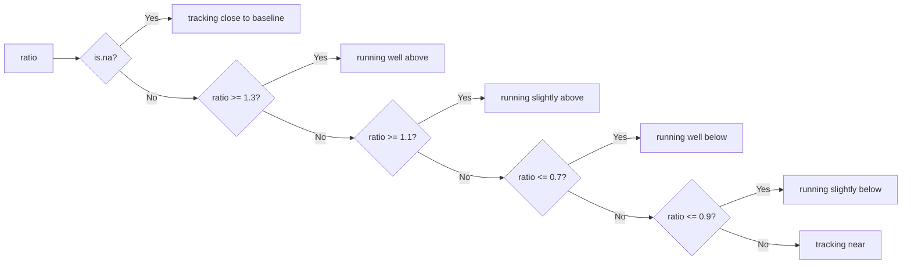
``` mermaid
flowchart LR
  ratio[ratio] --> NA?{is.na?}
  NA? -->|Yes| near1["tracking close to baseline"]
  NA? -->|No| R1{ratio >= 1.3?}
  R1 -->|Yes| well_above["running well above"]
  R1 -->|No| R2{ratio >= 1.1?}
  R2 -->|Yes| slight_above["running slightly above"]
  R2 -->|No| R3{ratio <= 0.7?}
  R3 -->|Yes| well_below["running well below"]
  R3 -->|No| R4{ratio <= 0.9?}
  R4 -->|Yes| slight_below["running slightly below"]
  R4 -->|No| near2["tracking near"]
```

------------------------------------------------------------------------

## 11. Auto-Text Generation — Season Badge

`season_badge_label_text()` and `season_badge_state_class()` in [`Scripts/V1_Dashboard_setup.R`](Scripts/V1_Dashboard_setup.R) drive the region hero badge (e.g. "Season running high") and its CSS class for styling.

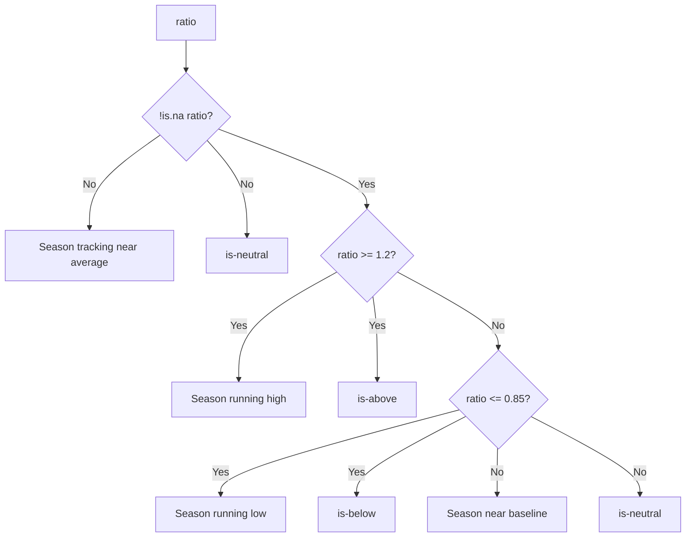
``` mermaid
flowchart TB
  ratio[ratio] --> Valid{!is.na ratio?}
  Valid -->|No| NeutralLabel["Season tracking near average"]
  Valid -->|No| NeutralClass[is-neutral]
  Valid -->|Yes| R1{ratio >= 1.2?}
  R1 -->|Yes| High["Season running high"]
  R1 -->|Yes| Above[is-above]
  R1 -->|No| R2{ratio <= 0.85?}
  R2 -->|Yes| Low["Season running low"]
  R2 -->|Yes| Below[is-below]
  R2 -->|No| Base["Season near baseline"]
  R2 -->|No| Neutral2[is-neutral]
```

------------------------------------------------------------------------

## 12. Auto-Text Generation — Global Scrollytelling

`build_global_story_points()` in [`Scripts/figures/FUN_utility.R`](Scripts/figures/FUN_utility.R) builds the 5-part narrative for the home page scrolly section from `world_summary`: (1) monthly global case count, (2) monthly ratio and month-over-month direction, (3) YTD cases, (4) YTD ratio, (5) season status. Month-over-month direction uses `classify_modifier()`-style logic for ratio; delta uses -5% / +5% thresholds for "decrease" / "increase" / "similar level".

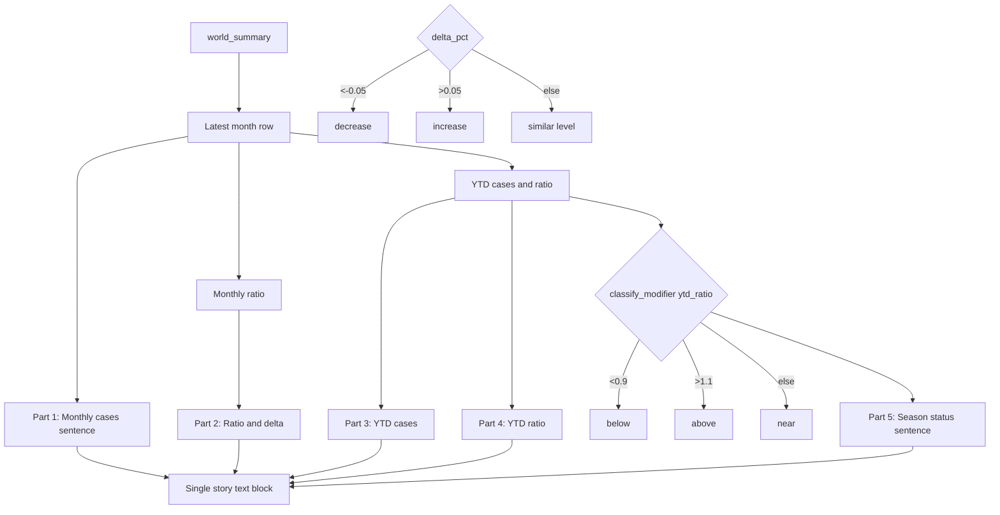
``` mermaid
flowchart TB
  world_summary[world_summary] --> Latest[Latest month row]
  Latest --> P1[Part 1: Monthly cases sentence]
  Latest --> MonthlyRatio[Monthly ratio]
  MonthlyRatio --> P2[Part 2: Ratio and delta]
  Delta{delta_pct}
  Delta -->|<-0.05| dec[decrease]
  Delta -->|>0.05| inc[increase]
  Delta -->|else| sim[similar level]
  Latest --> YTD[YTD cases and ratio]
  YTD --> P3[Part 3: YTD cases]
  YTD --> P4[Part 4: YTD ratio]
  YTD --> Mod{classify_modifier ytd_ratio}
  Mod -->|<0.9| below[below]
  Mod -->|>1.1| above[above]
  Mod -->|else| near[near]
  Mod --> P5[Part 5: Season status sentence]
  P1 --> Story[Single story text block]
  P2 --> Story
  P3 --> Story
  P4 --> Story
  P5 --> Story
```

`classify_modifier(ratio)`: `ratio < 0.9` → "below", `ratio > 1.1` → "above", else "near".

------------------------------------------------------------------------

## 13. Auto-Text Generation — Country Severity Blurbs

`severity_country_blurb()` in [`Scripts/figures/FUN_utility.R`](Scripts/figures/FUN_utility.R) generates the per-country narrative used on the home page (high-severity panel), region pages, and country index. Status uses the same thresholds: below (\<0.9), above (\>1.1), near (else).

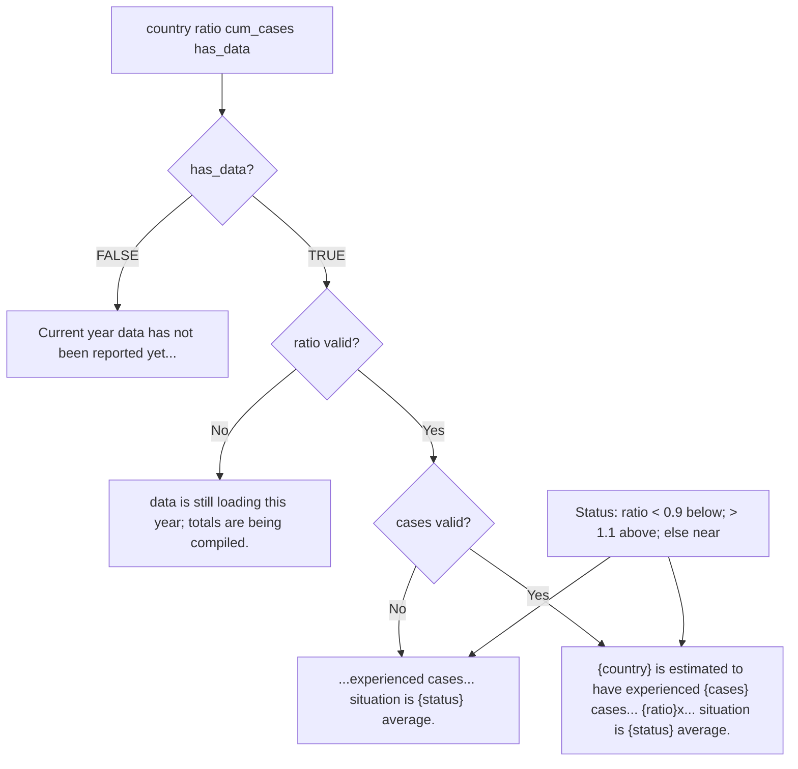
``` mermaid
flowchart TB
  Input[country ratio cum_cases has_data] --> has_data{has_data?}
  has_data -->|FALSE| NoData["Current year data has not been reported yet..."]
  has_data -->|TRUE| ratio_ok{ratio valid?}
  ratio_ok -->|No| Loading["data is still loading this year; totals are being compiled."]
  ratio_ok -->|Yes| cases_ok{cases valid?}
  cases_ok -->|No| Partial["...experienced cases... situation is {status} average."]
  cases_ok -->|Yes| Full["{country} is estimated to have experienced {cases} cases... {ratio}x... situation is {status} average."]
  status_calc[Status: ratio < 0.9 below; > 1.1 above; else near]
  status_calc --> Full
  status_calc --> Partial
```

------------------------------------------------------------------------

## 14. Auto-Text Generation — Region Callouts

Region-level sentences are built in [`Scripts/V1_Dashboard_setup.R`](Scripts/V1_Dashboard_setup.R) in the `region_callouts` block. For each region, two sentences are produced using `glue()` and the ratio/badge helpers above.

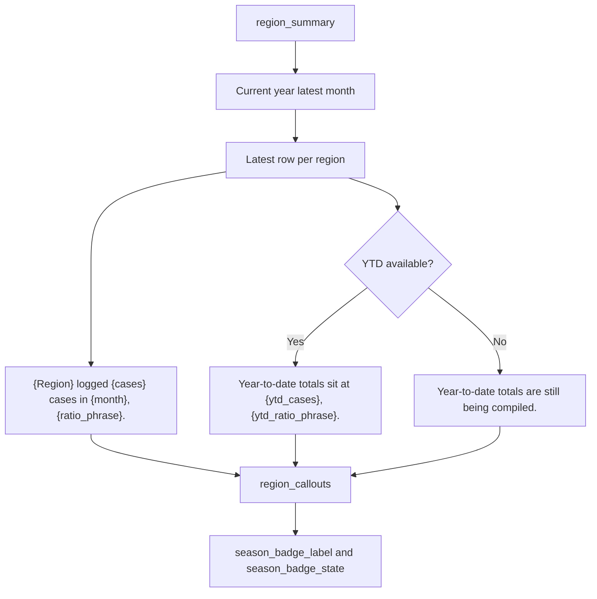
``` mermaid
flowchart TB
  region_summary[region_summary] --> Filter[Current year latest month]
  Filter --> LatestRow[Latest row per region]
  LatestRow --> LatestSentence["{Region} logged {cases} cases in {month}, {ratio_phrase}."]
  LatestRow --> YTDCheck{YTD available?}
  YTDCheck -->|Yes| YTDSentence["Year-to-date totals sit at {ytd_cases}, {ytd_ratio_phrase}."]
  YTDCheck -->|No| YTDFallback["Year-to-date totals are still being compiled."]
  LatestSentence --> region_callouts[region_callouts]
  YTDSentence --> region_callouts
  YTDFallback --> region_callouts
  region_callouts --> Badge[season_badge_label and season_badge_state]
```

------------------------------------------------------------------------

## 15. Auto-Text Generation — Country Summary and Season Status

`country_summary_df` is built in [`Scripts/V1_Dashboard_setup.R`](Scripts/V1_Dashboard_setup.R): filter to current year, group by country, compute recent and cumulative ratios (ratio capped to \[0.5, 2\] via `pmin(pmax(ratio, 0.5), 2)`), and assign `SeasonStatus`. **`SeasonStatus` is derived from `RecentRatio` (single latest month), not from `cum_ratio`**, using thresholds `> 1.2` above / `< 0.8` below / else near — note these thresholds (1.2/0.8) differ from the 1.1/0.9 thresholds used by `ratio_phrase()` and `classify_modifier()` elsewhere in the dashboard; this inconsistency exists in the code as of this writing and has not been reconciled. Top 5 severity countries are selected by `arrange(desc(cum_ratio)) %>% slice_head(n = 5)` (after dropping NA/infinite `cum_ratio`).

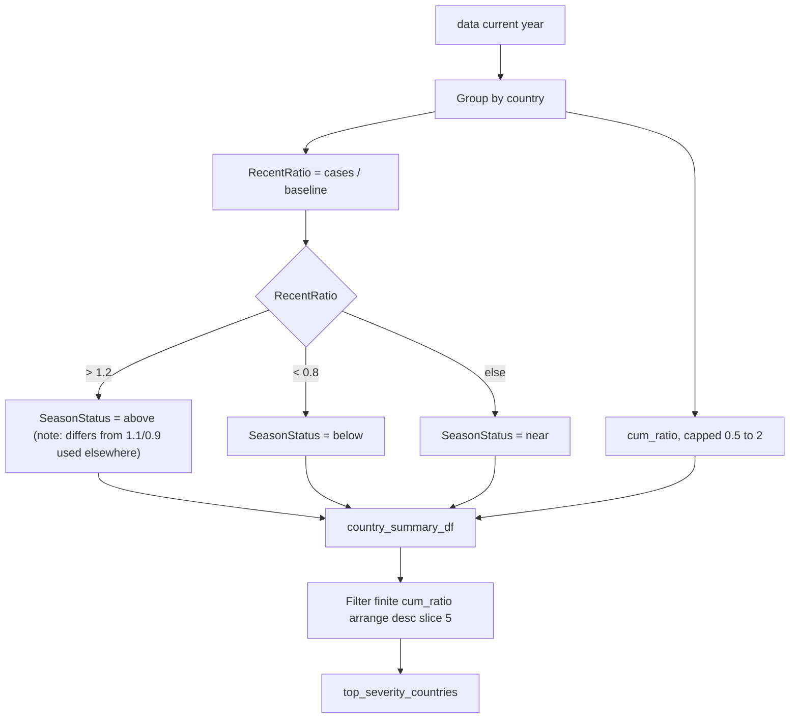
``` mermaid
flowchart TB
  data[data current year] --> Group[Group by country]
  Group --> RecentRatio[RecentRatio = cases / baseline]
  Group --> CumRatio[cum_ratio, capped 0.5 to 2]
  RecentRatio --> Status{RecentRatio}
  Status -->|> 1.2| above["SeasonStatus = above (note: differs from 1.1/0.9 used elsewhere)"]
  Status -->|< 0.8| below[SeasonStatus = below]
  Status -->|else| near[SeasonStatus = near]
  above --> country_summary_df[country_summary_df]
  below --> country_summary_df
  near --> country_summary_df
  CumRatio --> country_summary_df
  country_summary_df --> Top5[Filter finite cum_ratio arrange desc slice 5]
  Top5 --> top_severity_countries[top_severity_countries]
```

------------------------------------------------------------------------

## 16. Dashboard Page Architecture

The site is a Quarto website (output to `docs/`). Navigation: Home, All Countries, Regions (8 pages), Methods, Data, About, FAQ. National pages for ~81 countries (`pages/country/*.qmd`, rendered via a wildcard entry in `_quarto.yml`, generated from `country-config.csv` — see Section 21) are also rendered. All dynamic pages source `V1_Dashboard_setup.R` and consume the objects it creates. The site URL is `https://globaldengueobservatory.org/`.

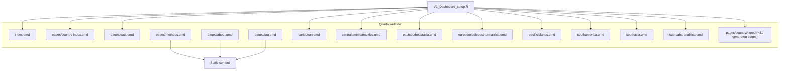
``` mermaid
flowchart TB
  subgraph quarto [Quarto website]
    Index[index.qmd]
    CountryIndex[pages/country-index.qmd]
    DataPage[pages/data.qmd]
    Methods[pages/methods.qmd]
    About[pages/about.qmd]
    FAQ[pages/faq.qmd]
    R1[caribbean.qmd]
    R2[centralamericamexico.qmd]
    R3[eastsoutheastasia.qmd]
    R4[europemiddleeastnorthafrica.qmd]
    R5[pacificislands.qmd]
    R6[southamerica.qmd]
    R7[southasia.qmd]
    R8[sub-saharanafrica.qmd]
    Countries["pages/country/*.qmd (~81 generated pages)"]
  end
  Setup[V1_Dashboard_setup.R]
  Setup --> Index
  Setup --> CountryIndex
  Setup --> DataPage
  Setup --> R1
  Setup --> R2
  Setup --> R3
  Setup --> R4
  Setup --> R5
  Setup --> R6
  Setup --> R7
  Setup --> R8
  Setup --> Countries
  Methods --> Static[Static content]
  About --> Static
  FAQ --> Static
```

| Page                    | Dynamic content                                                                                                              |
|-------------------------|------------------------------------------------------------------------------------------------------------------------------|
| **index.qmd**           | Global plot, scrolly narrative, world map with 8 region plots, top 5 severity country cards                                  |
| **Regional (8)**        | Region map, region radial plot, latest/YTD sentences, season badge, country plot grid with blurbs                            |
| **country-index.qmd**   | All country cards with blurbs, search/filter/sort                                                                            |
| **Country (~81, generated)** | Country context map, radial plot, season badge, Chart.js interactive time series with comparison years, calibrated prediction intervals |
| **data.qmd**            | Downloadable CSV, last-updated label, data table                                                                             |
| **methods, about, faq** | Static only                                                                                                                  |

------------------------------------------------------------------------

## 17. Country Data Status Classification

`get_country_data_status()` in [`Scripts/V1_Dashboard_setup.R`](Scripts/V1_Dashboard_setup.R) labels each country based on the last 3 months of the current year: whether they contain "Estimates" (nowcasted) or observed source.

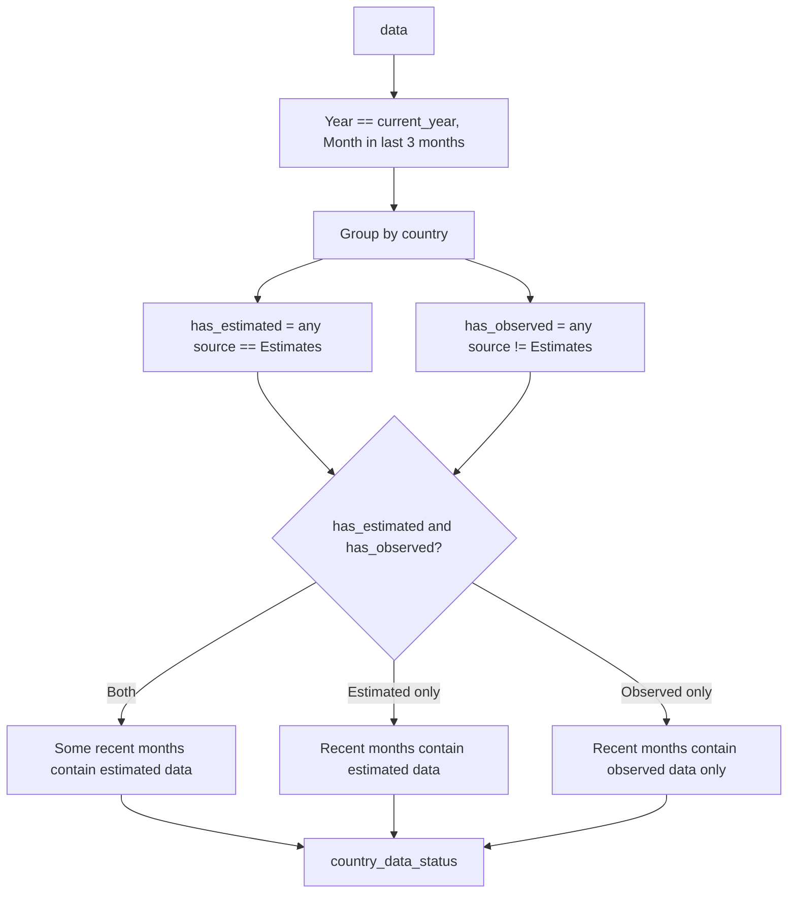
``` mermaid
flowchart TB
  data[data] --> Filter[Year == current_year, Month in last 3 months]
  Filter --> Group[Group by country]
  Group --> HasEst[has_estimated = any source == Estimates]
  Group --> HasObs[has_observed = any source != Estimates]
  HasEst --> Msg{has_estimated and has_observed?}
  HasObs --> Msg
  Msg -->|Both| Some["Some recent months contain estimated data"]
  Msg -->|Estimated only| Est["Recent months contain estimated data"]
  Msg -->|Observed only| Obs["Recent months contain observed data only"]
  Some --> country_data_status[country_data_status]
  Est --> country_data_status
  Obs --> country_data_status
```

------------------------------------------------------------------------

## 18. Map Generation Pipeline

Choropleth ratio maps are produced separately from the dashboard render by two standalone scripts. Both load the latest `DENV_cases_nowcast_output.csv` from `Output/`, mask future months, and delegate to shared functions in [`Scripts/figures/FUN_map.R`](Scripts/figures/FUN_map.R).

### 18a. Global Ratio Map

[`Scripts/figures/run_global_map.R`](Scripts/figures/run_global_map.R) produces `Assets/Dynamic/global_ratio_map.png`. It calls `build_world_sf()` (Natural Earth 1:10 m countries + overseas territories for France, Netherlands, New Zealand, with OpenDengue region labels) and `make_global_ratio_map()`.

### 18b. Region Ratio Maps

[`Scripts/figures/run_region_maps.R`](Scripts/figures/run_region_maps.R) iterates over the eight observatory regions, calls `make_region_ratio_map()` for each, and saves PNGs to `Assets/Dynamic/region_maps/{slug}.png`. Each region has a hand-tuned bounding box so the map is cropped to the relevant area, with non-region land shown in grey.

### 18c. Cumulative Ratio Calculation

`compute_cum_ratio_by_iso3()` in `FUN_map.R` filters to the target year and months ≤ the target month, sums observed `cases` and `Ave_season_monthly_cases` per ISO3, computes `cum_ratio = cum_high / cum_low`, and caps to \[0.5, 2\] (`cum_ratio_capped`).

### 18d. Colour Scale

`map_ratio_fill_scale()` uses a diverging green → yellow → red gradient (`#7CC8AE` / `#F2D06B` / `#E07A6E`, midpoint = 1, limits \[0.5, 2\]). Countries with no data are `grey80`.

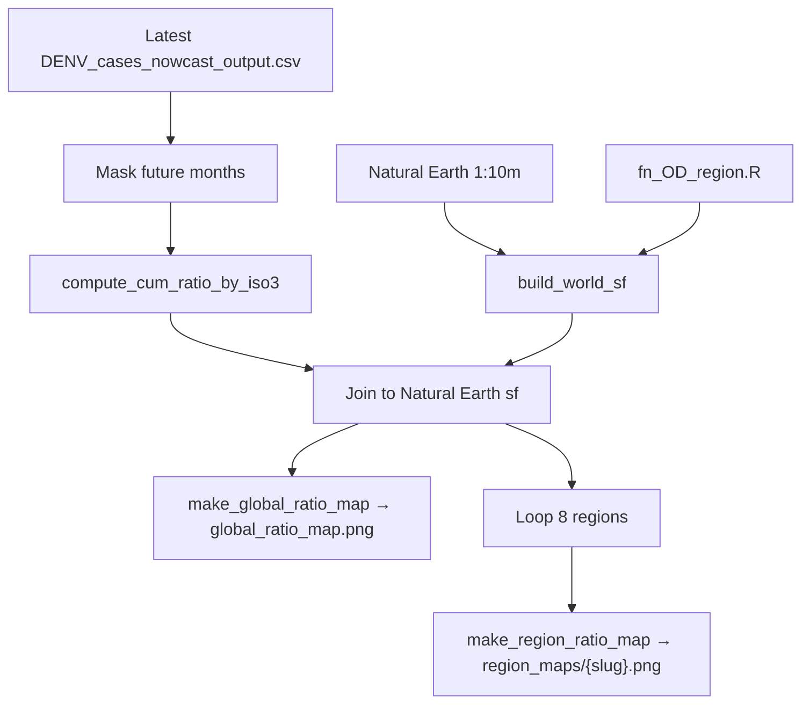
``` mermaid
flowchart TB
  NowcastCSV[Latest DENV_cases_nowcast_output.csv] --> MaskFuture[Mask future months]
  MaskFuture --> CumRatio[compute_cum_ratio_by_iso3]
  CumRatio --> JoinSF[Join to Natural Earth sf]
  JoinSF --> GlobalMap[make_global_ratio_map → global_ratio_map.png]
  JoinSF --> RegionLoop[Loop 8 regions]
  RegionLoop --> RegionMap["make_region_ratio_map → region_maps/{slug}.png"]
  NE[Natural Earth 1:10m] --> BuildSF[build_world_sf]
  OD[fn_OD_region.R] --> BuildSF
  BuildSF --> JoinSF
```

------------------------------------------------------------------------

## 19. Country Context Maps

[`Scripts/figures/FUN_country_map.R`](Scripts/figures/FUN_country_map.R) generates static locator maps for national pages. `make_country_context_map(iso3, region)` highlights a single country within its region using the same bounding boxes as the region ratio maps. Regional neighbours appear in light grey; the target country is filled using `highlight_fill`, which defaults to `grey55` and is not overridden by any current caller — **the target country is not rendered in teal**, despite `#1f6f63` being the site's brand teal used elsewhere (e.g. `style.css`). `save_country_context_map()` writes the output to `Assets/Stable/country_maps/{iso3}.png`. These PNGs are referenced by the generated country `.qmd` pages.

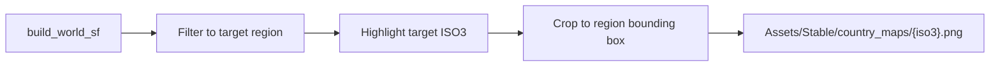
``` mermaid
flowchart LR
  WorldSF[build_world_sf] --> FilterRegion[Filter to target region]
  FilterRegion --> Highlight[Highlight target ISO3]
  Highlight --> CropBBox[Crop to region bounding box]
  CropBBox --> Save["Assets/Stable/country_maps/{iso3}.png"]
```

------------------------------------------------------------------------

## 20. Validation Framework

Retrospective validation is split into small scripts under `Scripts/validation/`, orchestrated by [`Scripts/validation/ORC_nowcast_validation.R`](Scripts/validation/ORC_nowcast_validation.R). Shared helpers for the LOSO loop live in [`Scripts/validation/FUNCTIONS/00_FUN_validation_metrics.R`](Scripts/validation/FUNCTIONS/00_FUN_validation_metrics.R) (`fit_baseline_profile`, `nowcast_one_cutoff`). The pipeline writes `full_data_season_monthly_proportions.csv` into each dated `Output/YYYY_MM_DD/` folder ([`Scripts/V1_Pipeline.R`](Scripts/V1_Pipeline.R) Step 8); validation reads the **latest** dated folder that contains this file so runs are reproducible without re-sourcing raw APIs.

### 20a. Individual errors (`03_nowcast_validation_ind.R`)

Reads the saved proportions table, joins `Region` from `Assets/Stable/OD_maps/pred_downscale_with_ci_V3.csv`, and runs **leave-one-season-out** validation for each country with ≥ 3 seasons: for each held-out season, the mean seasonal profile is estimated from all other seasons; cutoffs `k = 1..11` simulate observing months `1..k` only; months `k+1..12` are nowcast and compared to truth. Output: `Output/validation/validation_detail.csv` (per-row `absolute_error`, `squared_error`, `relative_error` with `actual_cases > 0` guard).

### 20b. Summaries, quantiles, coverage (`03_nowcast_validation_summary.R`)

Reads `validation_detail.csv` and writes:

- **Country summary** — MAE, RMSE, `MRE_signed`, `MRE_abs`, `n_seasons`; **composite z tiering** on `RMSE / mean_monthly_cases` and `|MRE_signed|` → Good / Moderate / Poor tertiles.
- **Pair summaries** — by `(cutoff_month, prediction_month)` and by `(iso3, cutoff_month, prediction_month)`.
- **Quantile tables** — empirical relative-error quantiles (`q025`, `q25`, `q75`, `q975`) at **country**, **region**, and **global** levels (keyed by last-observation month × prediction month, not by horizon).
- **Operational lookup** — country-level quantiles only, rows with `n_obs < 5` dropped; mirrored to `Assets/Stable/calibrated_prediction_intervals.csv`. Columns include `prediction_month` (not `horizon`) and `q025` / `q975` (not `q025_rel`).
- **Coverage** — `coverage_summary.csv`: empirical 95% / 50% interval coverage after applying the methods formula `max(0, predicted × (1 + q))` to rows that match the operational lookup.

### 20c. Snapshot convergence (`03_nowcast_validation_snapshots.R`)

Scans dated `Output/YYYY_MM_DD/` folders for `DENV_cases_nowcast_output.csv`, keeps `Data_status == "Unobserved"` and `source == "Estimates"`, defines the **final** estimate as the latest snapshot per `(iso3, Year, Month)`, and writes `snapshot_convergence_detail.csv` and `snapshot_convergence_summary.csv` (including first snapshot where absolute difference to final ≤ 1).

### 20d. Figures (`04_nowcast_validation_FIG.R`)

Eight publication-style figures (220 dpi PNGs, not six): error heatmap by `(cutoff_month, prediction_month)` (plus a country/global panel variant), nominal vs empirical coverage, world map of performance tier (plus a country score-map variant), RMSE_scaled by region, example nowcast fans (one country per tier at cutoffs 3/6/9), and an estimate-vs-observed comparison figure. Note: `fig_snapshot_convergence.png`, previously listed as an output here, is not currently written by any script in `Scripts/validation/` — a file with that name in `Output/validation/` is an orphan from an earlier version of the script and should not be treated as a live output.

### 20e. Ad hoc Brazil test (legacy)

[`Scripts/validation/04_nowcast_validation_BRA_test.R`](Scripts/validation/04_nowcast_validation_BRA_test.R) still sources the archived helper bundle [`Scripts/validation/FUNCTIONS/00_FUN_validation_metrics_legacy_BRA.R`](Scripts/validation/FUNCTIONS/00_FUN_validation_metrics_legacy_BRA.R) for a single-country moving-window diagnostic (independent of the main workflow above).

### 20f. Output files (current)

| File | Location |
|---|---|
| `validation_detail.csv` | `Output/validation/` |
| `summary_country.csv`, `summary_pair.csv`, `summary_country_pair.csv` | `Output/validation/` |
| `quantiles_country.csv`, `quantiles_region.csv`, `quantiles_global.csv` | `Output/validation/` |
| `calibrated_prediction_intervals.csv` | `Output/validation/` and `Assets/Stable/` |
| `coverage_summary.csv` | `Output/validation/` |
| `snapshot_convergence_detail.csv`, `snapshot_convergence_summary.csv` | `Output/validation/` |
| `estimate_vs_observed.csv` | `Output/validation/` (written by `03_nowcast_validation_snapshots.R`; previously omitted from this table) |
| `fig_error_heatmap_cutoff_pred.png`, `fig_error_heatmap_cutoff_pred_country_global_panel.png`, `fig_coverage_calibration.png`, `fig_country_tier_map.png`, `fig_country_score_map.png`, `fig_rmse_by_region_boxplot.png`, `fig_nowcast_fans.png`, `fig_estimate_vs_observed.png` | `Output/validation/` |
| `full_data_season_monthly_proportions.csv` | `Output/YYYY_MM_DD/` (pipeline artefact consumed by validation) |

**Undocumented / unintegrated scripts (as of this review):** `Scripts/validation/` also contains `03_GAMnowcast_validation_comparison.R`, `03_GAMnowcast_validation_ind.R`, `03_nowcast_validation_summary_2.R`, `04_nowcasting_summary.R`, `GDO_rf_applied_summary.R`, and a `V2_correction/` subfolder. None of these are sourced by `ORC_nowcast_validation.R` and they are not otherwise part of the documented workflow above — treat them as experimental/in-progress until integrated or removed.

------------------------------------------------------------------------

## 21. National (Country) Pages

**This section was substantially out of date and has been rewritten (previously described only 3 "pilot" pages for Brazil, Cuba, and Guyana).** As of this review, national pages have been launched for roughly 81 countries under `pages/country/`, generated from a shared template. See `national_pages_launch_report.md` for the launch history and country-inclusion criteria (7 countries excluded for insufficient current-year data: Bahamas, Bonaire/Sint Eustatius/Saba, Curaçao, Haiti, Indonesia, Nicaragua, Venezuela).

Each country's `.qmd` page is a thin generated wrapper (not a bespoke script) built by [`Scripts/country/generate_country_pages.R`](Scripts/country/generate_country_pages.R) from a single shared template, [`pages/country/_country-template.qmd`](pages/country/_country-template.qmd), and a registry file, [`pages/country/country-config.csv`](pages/country/country-config.csv), which is the source of truth for which countries get a page and what metadata (ISO3, display name, region, etc.) each page uses. `_quarto.yml` renders the whole set via a wildcard entry (`pages/country/*.qmd`) rather than an explicit page list, so adding a country is a matter of adding a row to `country-config.csv` and re-running the generator — see `pages/country/README_scaffold.md` and `pages/country/CONTEXT_national_pages.md` for the working process.

### 21a. Page Layout

Each generated country page sources `Scripts/V1_Dashboard_setup.R`, then builds:

1. **Hero panel** — a two-column grid with a static country context map (from `Assets/Stable/country_maps/`) on the left, and on the right: region banner, country heading, season badge (using `season_badge_label_text()` / `season_badge_state_class()`), radial clockface plot, and placeholder narrative text.
2. **Interactive time series** — a Chart.js line chart comparing the current year's monthly cases (observed vs estimated) against selectable comparison series (5-year average or individual prior years).
3. **Prediction intervals** — estimated months display 95% prediction intervals. **These are not NB-based** (as previously stated in this doc); they are empirical, validation-calibrated quantile intervals produced by the LOSO retrospective validation framework (Section 20) and applied via [`Scripts/utils/apply_calibrated_intervals.R`](Scripts/utils/apply_calibrated_intervals.R), sourced from `Scripts/V1_Dashboard_setup.R`. The interval width for a given country/month comes from `calibrated_prediction_intervals.csv` (Section 20b/20f), not from `nb_size`/`qnbinom`.

### 21b. Data Preparation

For each country page (via the shared template, parameterized by ISO3 from `country-config.csv`):

- The page's country data frame filters `data` to the target ISO3 and current year.
- YTD ratio is computed to drive the season badge.
- `ts_current` is a 12-row table (one per month) with `cases`, `average_cases`, `source`, `status` (Observed / Estimated / Unobserved), and calibrated `lower95`/`upper95`/`lower50`/`upper50` bounds (see 21a above — not NB-derived).
- `ts_historic` merges OpenDengue historic data (`pred_downscale_with_ci_V3.csv`) with pipeline output for the preceding 5 years, preferring pipeline values via `coalesce()`.

### 21c. Interactive Chart.js Visualisation

The time series chart is rendered client-side using Chart.js. It displays:

- **Current year observed** — solid teal line with filled points.
- **Current year estimated** — dashed teal line with hollow points.
- **95% prediction interval** — shaded fill between `lower95` and `upper95` for estimated months (calibrated quantile-based, not NB-based).
- **Comparison series** — user-selectable via checkboxes: 5-year average (grey) and individual prior years (colour-coded). The default selection is only the 5-year average.

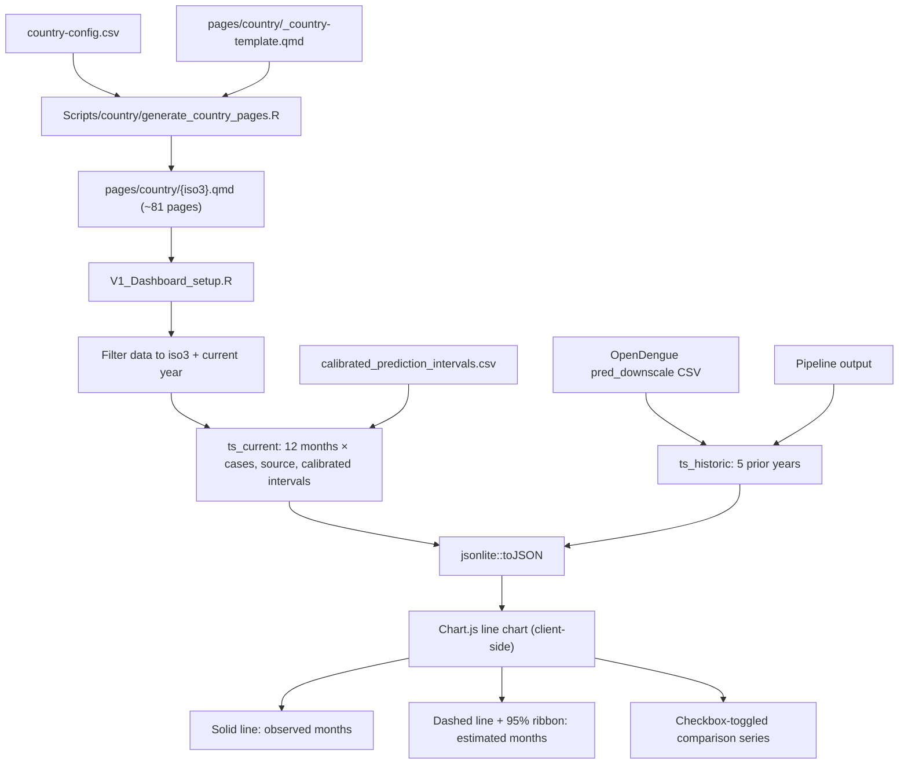
``` mermaid
flowchart TB
  Config["country-config.csv"] --> Generator["Scripts/country/generate_country_pages.R"]
  Template["pages/country/_country-template.qmd"] --> Generator
  Generator --> Pages["pages/country/{iso3}.qmd (~81 pages)"]
  Setup[V1_Dashboard_setup.R] --> CountryDF["Filter data to iso3 + current year"]
  CountryDF --> TsCurrent["ts_current: 12 months × cases, source, calibrated intervals"]
  Calibrated["calibrated_prediction_intervals.csv"] --> TsCurrent
  OD[OpenDengue pred_downscale CSV] --> TsHistoric["ts_historic: 5 prior years"]
  Pipeline[Pipeline output] --> TsHistoric
  TsCurrent --> JSON["jsonlite::toJSON"]
  TsHistoric --> JSON
  JSON --> ChartJS["Chart.js line chart (client-side)"]
  ChartJS --> Observed["Solid line: observed months"]
  ChartJS --> Estimated["Dashed line + 95% ribbon: estimated months"]
  ChartJS --> Compare["Checkbox-toggled comparison series"]
  Pages --> Setup
```

------------------------------------------------------------------------

## 22. Country Audit Script

[`Scripts/troubleshooting/audit_countries.R`](Scripts/troubleshooting/audit_countries.R) (previously listed at the incorrect path `Scripts/audit_countries.R`) is a QA tool that checks consistency between the All Countries index page and the eight regional pages. It:

1. Rebuilds the country list from `country_summary_df` (filtered to countries with a plot).
2. Classifies each country's data completeness: Full data, No current year data, Data still loading, or Cases being compiled.
3. Generates the accompanying text via `severity_country_blurb()` and the data status footnote.
4. Compares country membership between the All Countries page and each region page, reporting:
   - Countries on All Countries but not in any region.
   - Countries on a region page but missing from All Countries.
   - Per-region discrepancies.
5. Writes `audit_country_missingness.csv`. Note: as of this review the output path is hardcoded to a specific dated folder (`Output/2026_03_14/audit_country_missingness.csv`) rather than dynamically resolving the latest run, and the script also contains a hardcoded `setwd()` to a specific developer machine path — both are portability issues worth fixing rather than documenting as intended behaviour.

------------------------------------------------------------------------

## Key Source Files

### Pipeline and Data Processing

| File                                                                                                                                 | Role                                                    |
|--------------------------------------------------------------------------------------------------------------------------------------|---------------------------------------------------------|
| [Scripts/V1_Pipeline.R](Scripts/V1_Pipeline.R)                                                                                       | Pipeline orchestrator                                   |
| [Scripts/data_sourcing/01_dengue_data.R](Scripts/data_sourcing/01_dengue_data.R)                                                     | Data ingestion (PAHO, WHO, SEARO, OpenDengue)           |
| [Scripts/data_sourcing/01_select_historic_data.R](Scripts/data_sourcing/01_select_historic_data.R)                                   | Historic OD + WHO selection and deduplication            |
| [Scripts/seasonal_baseline/02_identify_seasonal_baseline.R](Scripts/seasonal_baseline/02_identify_seasonal_baseline.R)               | Seasonal baseline and NB params                         |
| [Scripts/backfilling/02_V2_monthly_source_selection.R](Scripts/backfilling/02_V2_monthly_source_selection.R)                         | V2 backfill, source merge, current_data output          |
| [Scripts/backfilling/02_V2_backfilling.R](Scripts/backfilling/02_V2_backfilling.R)                                                   | PAHO + WHO delay correction and audit CSVs                |
| [Scripts/backfilling/FUNCTIONS/00_FUN_apply_delay_correction.R](Scripts/backfilling/FUNCTIONS/00_FUN_apply_delay_correction.R)     | Source-aware RF join, rules, raw/corrected/applied cols |
| [Scripts/backfilling/FUNCTIONS/00_FUN_paho_data_process.R](Scripts/backfilling/FUNCTIONS/00_FUN_paho_data_process.R)                 | PAHO monthly cumulative/incident transforms             |
| [Scripts/backfilling/00_RF_calculate.R](Scripts/backfilling/00_RF_calculate.R)                                                       | Monthly empirical RF refresh from crawlers              |
| [Assets/Stable/paho_rf_lookup.csv](Assets/Stable/paho_rf_lookup.csv)                                                                 | Stable PAHO RF lookup (weekly d)                        |
| [Assets/Stable/who_rf_lookup.csv](Assets/Stable/who_rf_lookup.csv)                                                                   | Stable WHO RF lookup (monthly d)                        |
| [Scripts/nowcasting/03_proportion_nowcast.R](Scripts/nowcasting/03_proportion_nowcast.R)                                             | Proportion nowcasting                                   |
| [Scripts/utils/logging.R](Scripts/utils/logging.R)                                                                                   | Pipeline logging                                        |
| [Scripts/utils/country_tracking.R](Scripts/utils/country_tracking.R)                                                                 | Country attrition tracking per pipeline step            |

### Dashboard and Visualisation

| File                                                                                                                                 | Role                                                    |
|--------------------------------------------------------------------------------------------------------------------------------------|---------------------------------------------------------|
| [Scripts/V1_Dashboard_setup.R](Scripts/V1_Dashboard_setup.R)                                                                         | Dashboard data prep, text helpers, plot generation       |
| [Scripts/figures/FUN_utility.R](Scripts/figures/FUN_utility.R)                                                                       | Scrolly text, severity blurbs, region/country rendering |
| [Scripts/figures/Radial.R](Scripts/figures/Radial.R)                                                                                 | Radial clockface plot                                   |
| [Scripts/figures/FUN_map.R](Scripts/figures/FUN_map.R)                                                                               | Shared map functions (world sf, ratio calculation, scales) |
| [Scripts/figures/FUN_country_map.R](Scripts/figures/FUN_country_map.R)                                                               | Country context locator maps for national pages         |
| [Scripts/figures/run_global_map.R](Scripts/figures/run_global_map.R)                                                                 | Standalone: generates global choropleth ratio map        |
| [Scripts/figures/run_region_maps.R](Scripts/figures/run_region_maps.R)                                                               | Standalone: generates eight regional choropleth maps     |
| [Scripts/utils/apply_calibrated_intervals.R](Scripts/utils/apply_calibrated_intervals.R)                                             | Applies validation-calibrated quantile prediction intervals to national-page time series |
| [Assets/Stable/OD_maps/fn_OD_region.R](Assets/Stable/OD_maps/fn_OD_region.R)                                                       | OpenDengue region assignment lookup                     |

### Validation

| File | Role |
|---|---|
| [Scripts/validation/ORC_nowcast_validation.R](Scripts/validation/ORC_nowcast_validation.R) | Orchestrator: runs validation + figures in order |
| [Scripts/validation/03_nowcast_validation_ind.R](Scripts/validation/03_nowcast_validation_ind.R) | LOSO detail → `validation_detail.csv` |
| [Scripts/validation/03_nowcast_validation_summary.R](Scripts/validation/03_nowcast_validation_summary.R) | Summaries, quantiles, calibrated lookup, coverage |
| [Scripts/validation/03_nowcast_validation_snapshots.R](Scripts/validation/03_nowcast_validation_snapshots.R) | Snapshot convergence CSVs |
| [Scripts/validation/04_nowcast_validation_FIG.R](Scripts/validation/04_nowcast_validation_FIG.R) | Publication figures |
| [Scripts/validation/FUNCTIONS/00_FUN_validation_metrics.R](Scripts/validation/FUNCTIONS/00_FUN_validation_metrics.R) | LOSO helpers: `fit_baseline_profile`, `nowcast_one_cutoff` |
| [Scripts/validation/FUNCTIONS/00_FUN_validation_metrics_legacy_BRA.R](Scripts/validation/FUNCTIONS/00_FUN_validation_metrics_legacy_BRA.R) | Legacy bundle for `04_nowcast_validation_BRA_test.R` only |

### Quality Assurance

| File                                                                                                                                 | Role                                                    |
|--------------------------------------------------------------------------------------------------------------------------------------|---------------------------------------------------------|
| [Scripts/troubleshooting/audit_countries.R](Scripts/troubleshooting/audit_countries.R)                                              | Country consistency audit (All Countries vs Regions)    |

### Quarto Pages

| File                                                                                                                                 | Role                                                    |
|--------------------------------------------------------------------------------------------------------------------------------------|---------------------------------------------------------|
| [index.qmd](index.qmd)                                                                                                              | Home page with global scrolly narrative                  |
| [pages/country-index.qmd](pages/country-index.qmd)                                                                                 | All Countries searchable index                           |
| [pages/country/_country-template.qmd](pages/country/_country-template.qmd)                                                         | Shared template for all generated country pages          |
| [pages/country/country-config.csv](pages/country/country-config.csv)                                                               | Registry of ~81 countries with published pages            |
| [Scripts/country/generate_country_pages.R](Scripts/country/generate_country_pages.R)                                               | Generates `pages/country/{iso3}.qmd` from template + config |
| [pages/data.qmd](pages/data.qmd)                                                                                                   | Data download and table                                  |
| Regional `.qmd` (8 files)                                                                                                            | Region overview pages                                    |

------------------------------------------------------------------------

*Report generated for the DENV Global Observatory (last updated: July 2026, following a code-vs-documentation audit; supersedes the March 2026 version). All flowcharts use Mermaid syntax and render in Markdown viewers that support Mermaid (e.g. GitHub, Quarto, VS Code).*
